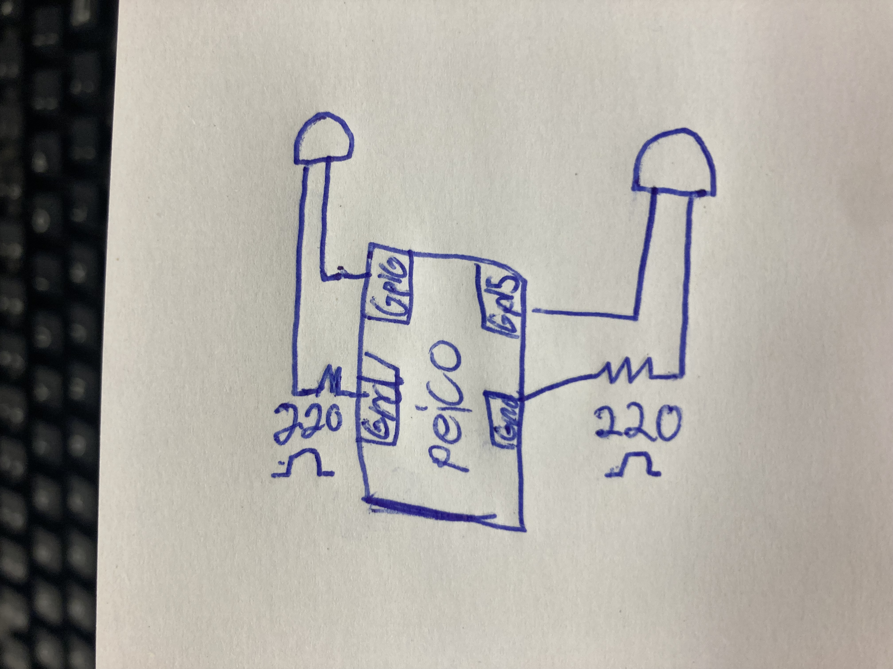
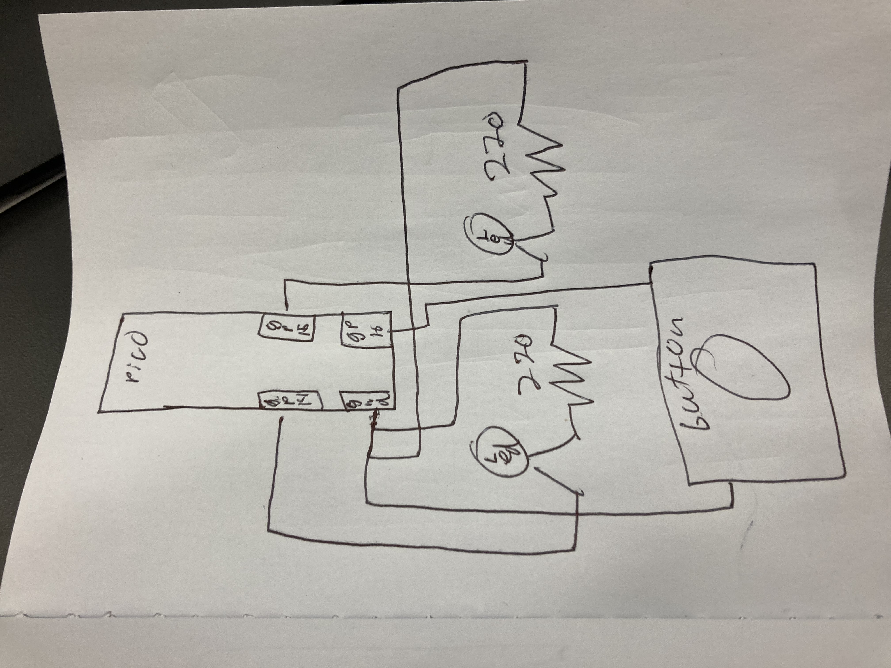
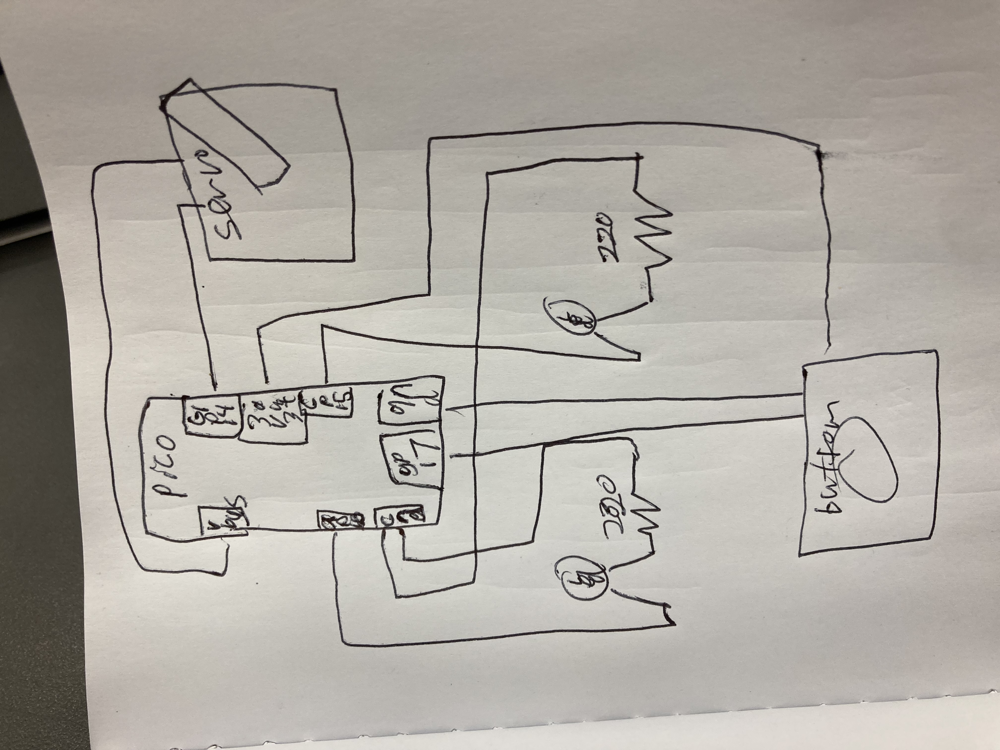
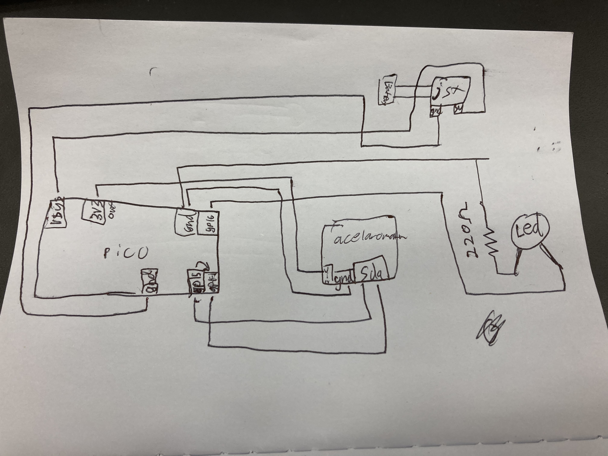
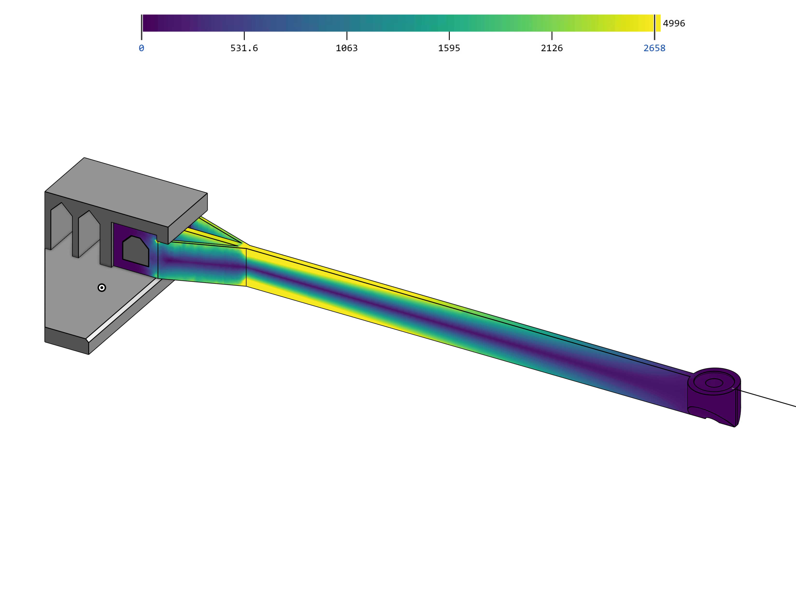

# Engineering_4_Notebook

&nbsp;

## Table of Contents

### Q1 Coding
* [Launch Pad Part 1 (Countdown)](#Launch_Pad_Part_1_(Countdown))
* [Launch Pad Part 2 (Lights)](#Launch_Pad_Part_2_(Lights))
* [Launch Pad Part 3 (Button)](#Launch_Pad_Part_3_(Button))
* [Launch Pad Part 4 (Servo)](#Launch_Pad_Part_4_(Servo))
* [Crash Avoidance Part 1 (Accelerometer)](#Crash_Avoidance_Part_1_(Accelerometer))
* [Crash Avoidance Part 1 (Light + Power)](Crash_Avoidanc_Part_2_(Light_+_Power))
&nbsp;

### Q1 CAD
* [FEA Part 1 (Beam Design)](FEA_Part_1_(Beam_Design))
* [FEA Part 3 (Analysis)](FEA_Part_3_(Analysis))
* [FEA Part 4 (Iterative Design)](FEA_Part_4_(Iterative_Design))
&nbsp;

&nbsp;
# Launch pad assignments

## Launch Pad Part 1 (Countdown)

### Assignment Description
 Write a code to print to the serial monitor a countdown from ten and at zero have it print “Liftoff”.

### Evidence 

    

### Wiring

    this was all done with the PICO and has no wiring

### [Link to the code](https://github.com/wbarnet76/eng_4_notebook-/blob/main/raspberry-pi/COUNTDOWN.py).
 

### Reflection

As the first assignment of the year this was not a difficult task. The purpose of this assignment to me was to knock the rust off and I did just that. The only problem I faced in this assignment was getting my numbers to count the right way and even that was a quick fix.

&nbsp;

## Launch Pad Part 2 (Lights)

### Assignment Description

Use your code from the last assignment [Launch Pad Part 1 (Countdown)](#Launch_Pad_Part_1_(Countdown)), and add two LEDs to it so that one blinks till the countdown ends, and the other turns on when “Liftoff” is printed on the serial montater.

### Evidence

### Wiring

### [Link to the code](https://github.com/wbarnet76/eng_4_notebook-/blob/main/raspberry-pi/liftoff_pt1.py)

### Reflection

This assignment built off the last assignment so to make this code I used old code I had made in engineering 3 and adapted it for the pico. Mixing the two codes was a bit of a challenge due to the fact that arduino and pico have slightly different commands and addresses for their boards. I did enjoy the finishing of this code because it felt good to be back after summer break doing engineering again. 

&nbsp;

## Launch Pad Part 3 (Button)

### Assignment Description

Use the last two assignments [Launch Pad Part 1 (Countdown)](#Launch_Pad_Part_1_(Countdown)) , [Launch Pad Part 2 (Lights)](#Launch_Pad_Part_2_(Lights)) and include a physical button that start the countdown to launch 

### Evidence

### Wiring

### [Link to the code](https://github.com/wbarnet76/eng_4_notebook-/blob/main/raspberry-pi/liftoff_button.py)

### Reflection

Having to build off the last two assignments made this one relatively easy to do. The biggest challenge was figuring out the input direction of the button, buttons have two different input directions and the one you chose will affect the code you make. I had chosen one input direction but used the code for the other input direction by accident. 

&nbsp;

## Launch Pad Part 4 (Servo)

### Assignment Description

This assignments has you use all of the prior assignments [Launch Pad Part 1 (Countdown)](#Launch_Pad_Part_1_(Countdown)) , [Launch Pad Part 2 (Lights)](#Launch_Pad_Part_2_(Lights)) , [Launch Pad Part 3 (Button)](#Launch_Pad_Part_3_(Button)) to then add a servo to the mix. This servo has to move 180 degrees at the end of the countdown to simulate Liftoff. 

### Evidence

  

### Wiring

   

### [Link to the code](https://github.com/wbarnet76/eng_4_notebook-/blob/main/raspberry-pi/LIFTOFF_servo.py)

### Reflection

Expanding on the code used in my other assignments this year by adding a servo proved difficult for me. The code was not necessarily the problem for this assignment, though adding the servo library was the hardest part of the code, for me it was difficult to start working because it seemed like a large challenge but it turns out it was probably the easiest assignment by far I only needed to add 5 lines of code.

&nbsp;

# Crash avoidance assignments
&nbsp;

## Crash Avoidance Part 1 (Accelerometer)

### Assignment Description

Write your assignment description here. What is the purpose of this assignment? It should be at least a few sentences.

### Evidence

### Wiring

### [Link to the code](https://github.com/wbarnet76/eng_4_notebook-/blob/main/raspberry-pi/acelaromter.py)

### Reflection

What went wrong / was challenging, how'd you figure it out, and what did you learn from that experience? Your goal for the reflection is to pass on knowledge that will make this assignment better or easier for the next person. Think about your audience for this one, which may be "future you" (when you realize you need some of this code in three months), me, or your college admission committee!

&nbsp;

## Crash Avoidance Part 2 (Light + Power)

### Assignment Description

The requirements for this project is to add lights and power. For the lights part you need to make the lights light up at certain values or past those values. For the power part your job is to make the PICO “headless” to have it not attached to the computer to make the PICO headless you need a battery that is wiring in to the PICO. 

### Evidence

### Wiring

### [Link to the code](https://github.com/wbarnet76/eng_4_notebook-/blob/main/raspberry-pi/crash_a_pt_2.py)

### Reflection

This assignment was a lot of fun for me because it was a mixed assignment as it had harder wiering and coding rather than just one or the other. The battery wiring proved to be difficult not because I did it wrong but because I forgot to charge the battery. And a similar thing happened with the lights i had a burnt out LED

&nbsp;
# CAD assignments
&nbsp;

## FEA Part 1 (Beam Design)

### Assignment Description

Starting in CAD this year is the beam design, for this one the job is to make a sturdy beam design that is under 13g and 180mm long. Then we test the beam to failure. The ways to fail are the beam dislaces 35, or snaps. These beams are 3d printed so the beams can't have angles under 45 degrees or overhangs because the 3d printer will throw a fit.

### Part Link

### [link to Onshape document](https://cvilleschools.onshape.com/documents/a0ee0fd238045dedbffc5568/w/546caeaada3c8b4c237ca2cc/e/3282756a5f5731191b2b56af)

### Part Image

.png)

### Reflection

Jumping back into cad for the first time this year was fun and this assignment was a great one to start on because it had a lot of requirements but left room for creativity in your designs. The no overhang requirement made me annoyed because I had a fun idea to use a helix as the beam but it had too many overhangs. Later I simulated it with FEA and it turned out it was a horrible design but I am still a little annoyed that I didn't get to try it out.

&nbsp;

## FEA Part 3 (Analysis)

FEA part 2 was skipped because it is a learning assignment for FEA
### Assignment Description

Take the beam that was bult in the last assignment and put into onshape’s built in FEA (Finite Element Analysis)  program to figure out what needs to be revised to make the beam more stable and add to the mass that your beam can hold.

### Part Link

### [link to Onshape document](https://cvilleschools.onshape.com/documents/a0ee0fd238045dedbffc5568/w/55686c014d636dc83c55b275/e/1352ff57328f37306558e33d)

### Part Image

.png)

### Reflection

 My team and i forgot to turn in the beam so it did not get printed so we had no data to work with in the analysis phase but our original beam would probably place in the middle of the groupes that had trials. 

&nbsp;

## FEA Part 4 (Iterative Design)

### Assignment Description

Take the data form your test and the FEA analysis and revise/remake your beam. 

### Part Link

### [link to Onshape document](https://cvilleschools.onshape.com/documents/a0ee0fd238045dedbffc5568/w/a2f252e180c3c964169692d2/e/1352ff57328f37306558e33d)

### Part Image

.png)

### Reflection

With out the data from the fist beam test it was difficult for my tem to make. 

&nbsp;
